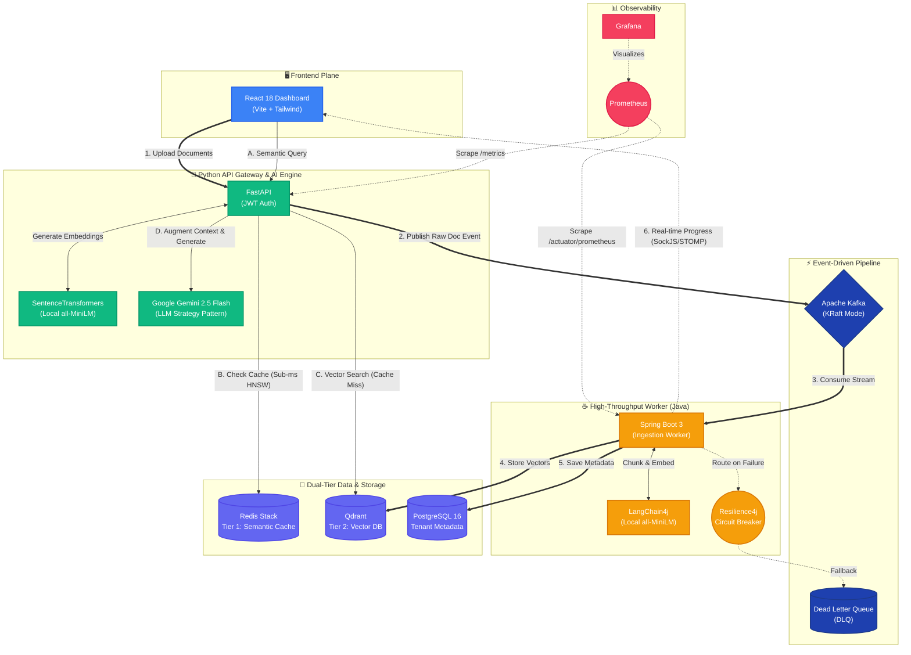
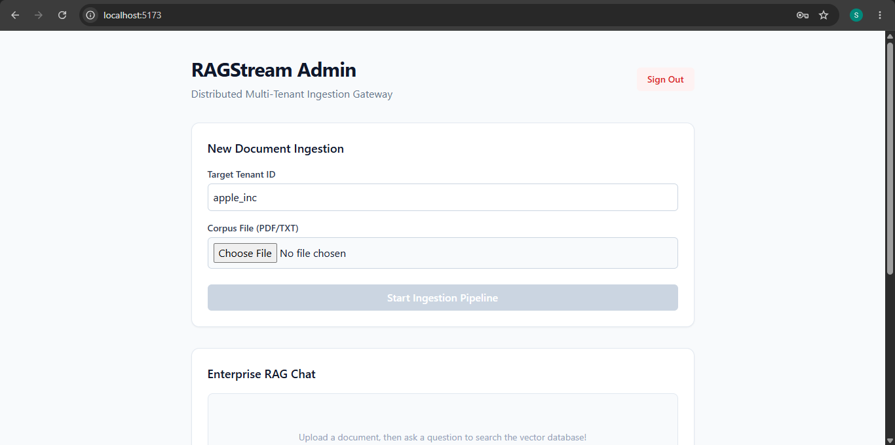
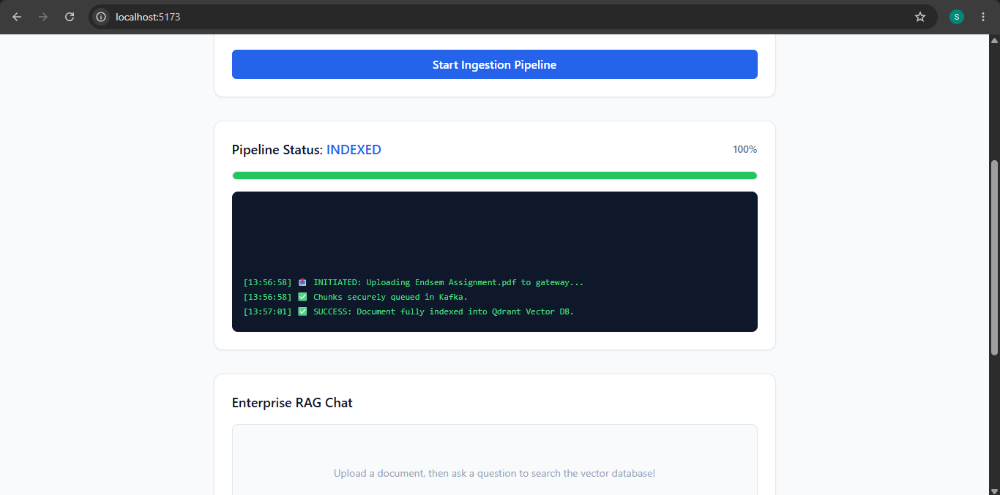
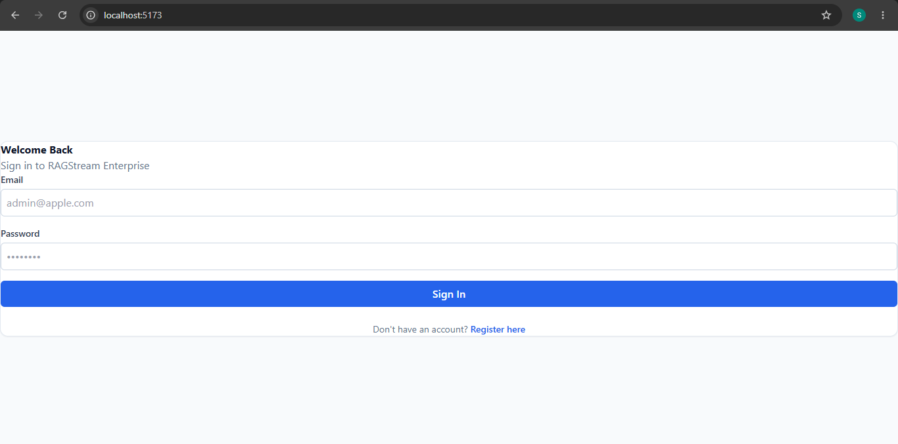
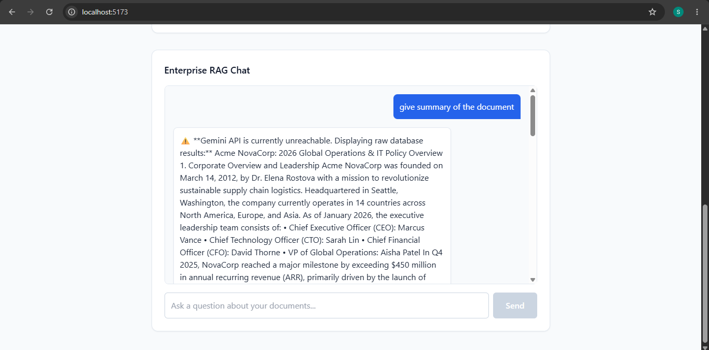
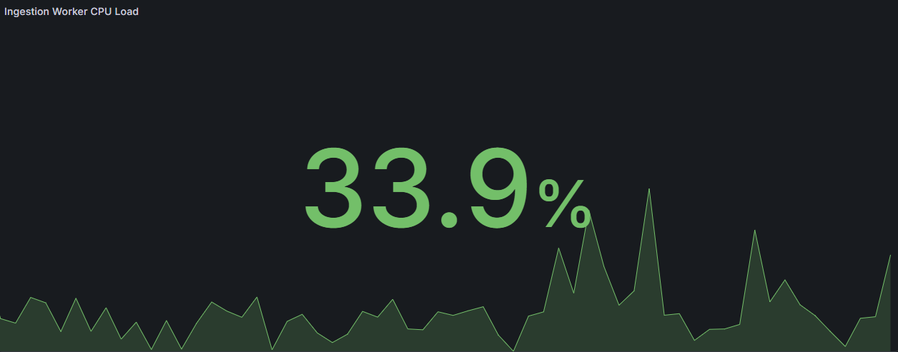
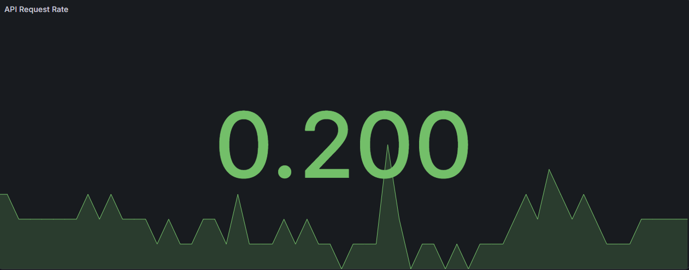

# RAGStream Enterprise

**A Distributed, Event-Driven, Multi-Tenant Retrieval-Augmented Generation (RAG) Architecture.**

RAGStream is a highly scalable, polyglot microservices platform designed for high-throughput enterprise document ingestion and intelligent semantic querying. It features strict multi-tenant data isolation via JWT, real-time WebSocket observability, dual-tier semantic caching, and an event-driven processing pipeline powered by Apache Kafka.

---


## System Architecture



## Core Architecture & Features

* **Strict Multi-Tenancy:** Secure data isolation using stateless JWTs and Spring Security. The `tenant_id` is encoded directly into custom token claims, ensuring organizations can only query and ingest data belonging to their specific vector namespaces.
* **Event-Driven Ingestion (Kafka):** Heavy document processing is entirely decoupled from the API layer. Raw PDFs are shipped via FastAPI to an Apache Kafka (KRaft) cluster. Java workers consume these streams, chunk the data, and publish back to Kafka for parallel processing.
* **Tiered RAG Architecture:**
    * **Tier 1 (Redis Stack):** Sub-millisecond semantic caching intercepting incoming vector queries to execute HNSW cosine-similarity matches, bypassing expensive LLM generation for recurrent requests.
    * **Tier 2 (Qdrant):** High-dimensional vector search isolated by tenant payloads.
* **Local AI Embeddings:** Both the Python Gateway and Java Workers utilize local `all-MiniLM-L6-v2` models (via `SentenceTransformers` and `LangChain4j`) to generate vector embeddings, resulting in zero API costs and zero network latency for data ingestion.
* **Enterprise Resilience:** 
    * **Circuit Breakers:** `Resilience4j` protects the Java Kafka publishers, routing to Dead Letter Queues (DLQ) if the broker is unreachable.
    * **LLM Strategy Pattern:** Python Gateway features automatic fallbacks. If the primary LLM (Google Gemini 2.5 Flash) fails, the system degrades gracefully to return raw vector database context.

* **Extensible Ingestion Pipeline:** Document parsing is built using the **Factory and Strategy Design Patterns**. The `DocumentParserFactory` dynamically routes incoming payloads (e.g., PDF, TXT) to the correct parsing strategy at runtime, ensuring the ingestion engine is highly modular and adheres strictly to the Open/Closed Principle.

* **Full-Stack Observability:** 
    * **Real-Time WebSockets:** Spring Boot `SimpMessagingTemplate` streams ingestion progress chunk-by-chunk to the React UI via SockJS/STOMP.
    * **Metrics:** Prometheus and Grafana continuously scrape data from Spring Boot Actuator and FastAPI Instrumentator.

---

## Platform Highlights

### Strict Multi-Tenancy
Secure data isolation using stateless JWTs and Spring Security. The `tenant_id` is encoded directly into custom token claims.



### Event-Driven Ingestion
Spring Boot `SimpMessagingTemplate` streams Kafka ingestion progress chunk-by-chunk to the React UI via SockJS/STOMP.



### Secure Authentication
The entire platform is gated behind stateless JWT authentication backed by Spring Security, ensuring that all REST APIs and real-time WebSocket streams are strictly protected. 



### Enterprise Resilience & Graceful Degradation
The Python API Gateway implements the Strategy Pattern for LLM generation. If the primary LLM (Google Gemini 2.5 Flash) experiences an outage or rate limit, the system gracefully degrades to return the raw, un-augmented vector database context—ensuring zero downtime for end users.



### Full-Stack Observability
System health and ingestion throughput are continuously monitored using Prometheus and visualized in real-time via Grafana.

| Ingestion Worker CPU Load | API Request Rate |
| :---: | :---: |
|  |  |

## Tech Stack

**Frontend Plane**
* React 18 + TypeScript + Vite
* Tailwind CSS
* Axios (with JWT Interceptors)
* SockJS & StompJS

**API Gateway & AI Engine (Python)**
* Python 3.11 / FastAPI
* Google GenAI SDK (Gemini 2.5 Flash)
* SentenceTransformers (Local Embeddings)

**High-Throughput Worker (Java)**
* Java 21 / Spring Boot 3
* Spring Security & JJWT
* Spring Kafka & LangChain4j
* Resilience4j (Circuit Breakers)
* Flyway (Database Migrations)

**Infrastructure & DevOps**
* Apache Kafka (KRaft mode)
* Qdrant (Vector Database)
* Redis Stack (Semantic Cache)
* PostgreSQL 16
* Prometheus & Grafana
* Kubernetes (Deployment, ConfigMaps, Secrets) & Testcontainers

---

## Getting Started

### Prerequisites
Ensure you have the following installed on your local machine:
* Docker & Docker Compose
* Java 21 & Maven
* Python 3.11+
* Node.js 18+

### 1. Start the Infrastructure & Observability Stack
Spin up Kafka, Redis, Qdrant, PostgreSQL, Prometheus, and Grafana:
```bash
docker-compose up -d
```
### 2. Start the AI Gateway (Python)
Navigate to the gateway directory, install dependencies, and start the FastAPI server:

```bash
cd llm-gateway
python -m venv venv
venv\Scripts\activate
pip install -r requirements.txt
```

Create a local environment file named `.env` inside the `llm-gateway` folder (this file should stay local and is not committed to GitHub):

```env
GEMINI_API_KEY=your_api_key_here
```

> Contributors should create their own `.env` file locally and paste their Gemini API key there before running the gateway.

Then, set a local JWT secret in your shell:

#### Windows PowerShell
```powershell
$env:JWT_SECRET="your-very-long-random-secret-here"
```

#### Linux/macOS
```bash
export JWT_SECRET="your-very-long-random-secret-here"
```

Then start the application:

```bash
uvicorn main:app --reload --port 8000
```

### 3. Start the Ingestion Worker (Java)
Navigate to the worker directory and run the Spring Boot application. Flyway will automatically migrate the PostgreSQL database on startup.

```bash
cd ingestion-worker
./mvnw spring-boot:run
```

### 4. Start the Frontend UI (React)
Navigate to the frontend directory, install packages, and start the development server:

```bash
cd admin-dashboard
npm install
npm run dev
```

Access the multi-tenant RAG dashboard at http://localhost:5173.

## Testing
This project utilizes Testcontainers for true integration testing against actual Docker instances of Kafka and PostgreSQL.

To run the Java integration tests:

```bash
cd ingestion-worker
./mvnw test
``` 
